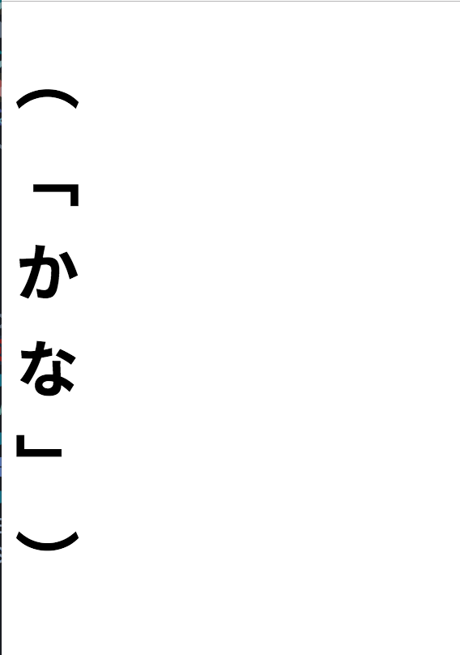

# batik-vertical-test

Testing some vertical rendering issues with apache batik.

## How To Run

### Java

```
./gradlew run
```

### In Browser
Navigate to the `web` directory and open `svg_page.html` in Chrome.

## The Difference
In the browser, punctuation is properly rotated, but in batik it is not.

Browser:


Batik:

